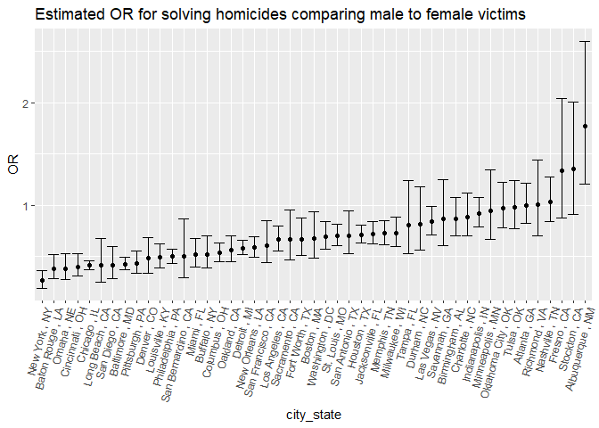
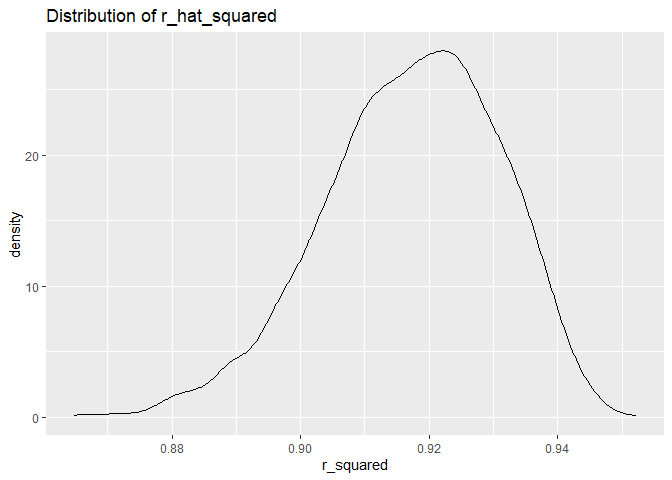
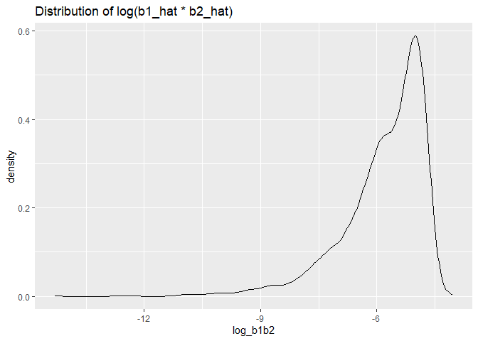
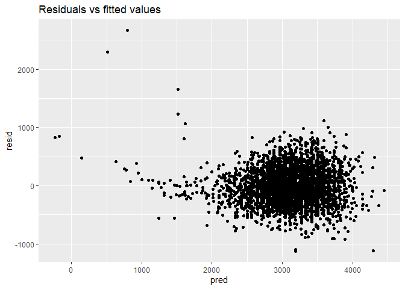
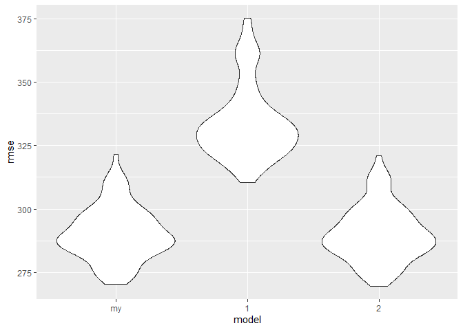

p8105_hw6_zl3386
================
Ziqiu Liu
2023-11-21

``` r
library(tidyverse)
library(rvest)
library(readr)
library(modelr)

set.seed(123)
```

## Problem 1

``` r
homicide_df = 
  read_csv("data/homicide-data.csv") |>
  mutate(
    victim_age = as.numeric(victim_age),
    state = toupper(state)
  ) |>
  mutate(
    # create a `city_state` variable
    city_state = paste(city, ",", state),
    # a binary variable indicating whether the homicide is solved
    resolved = case_match( 
      disposition,
      "Closed by arrest" ~ 1,
      c("Closed without arrest", "Open/No arrest") ~ 0,
    )
  ) |>
  # Omit cities that don’t report victim race and Tulsa, AL
  filter(!(city_state %in% c("Dallas , TX", "Phoenix , AZ", "Kansas City , MO"))) |> 
  filter(city_state != "Tulsa , AL") |>
  # limit to white or black victim_race
  filter(victim_race %in% c("White", "Black"))
```

    ## Rows: 52179 Columns: 12
    ## ── Column specification ────────────────────────────────────────────────────────
    ## Delimiter: ","
    ## chr (9): uid, victim_last, victim_first, victim_race, victim_age, victim_sex...
    ## dbl (3): reported_date, lat, lon
    ## 
    ## ℹ Use `spec()` to retrieve the full column specification for this data.
    ## ℹ Specify the column types or set `show_col_types = FALSE` to quiet this message.

    ## Warning: There was 1 warning in `mutate()`.
    ## ℹ In argument: `victim_age = as.numeric(victim_age)`.
    ## Caused by warning:
    ## ! NAs introduced by coercion

For the city of Baltimore, MD, use the `glm` function to fit a logistic
regression with resolved vs unresolved as the outcome and victim age,
sex and race as predictors.

Save the output of `glm` as an R object; apply the `broom::tidy` to this
object; and obtain the estimate and confidence interval of the adjusted
**odds ratio** for solving homicides comparing male victims to female
victims keeping all other variables fixed.

``` r
baltimore_df = homicide_df |>
  filter(city_state == "Baltimore , MD") |>
  select(resolved, victim_age, victim_sex, victim_race) 

fit_logistic =
  baltimore_df |>
  glm(resolved ~ victim_age + victim_sex + victim_race, data = _, family = binomial())

fit_logistic |>
  broom::tidy() |>
  mutate(
    OR = exp(estimate),
    ci_low = exp(estimate - std.error),
    ci_high = exp(estimate + std.error)
    ) |>
  select(term, OR, ci_low, ci_high) |>
  filter(term == "victim_sexMale")
```

    ## # A tibble: 1 × 4
    ##   term              OR ci_low ci_high
    ##   <chr>          <dbl>  <dbl>   <dbl>
    ## 1 victim_sexMale 0.426  0.371   0.489

Now run `glm` for each of the cities in your dataset, and extract the
adjusted odds ratio (and CI) for solving homicides comparing male
victims to female victims. Do this within a “tidy” pipeline, making use
of `purrr::map`, list columns, and unnest as necessary to create a
dataframe with estimated ORs and CIs for each city.

``` r
or_df =
  homicide_df |>
  select(city_state, resolved, victim_age, victim_sex, victim_race) |>
  nest(resolved_info = -city_state) |>
  mutate(
    test = map(resolved_info, \(df) glm(resolved ~ victim_age + victim_sex + victim_race, data = df, family = binomial())),
    results = map(test, broom::tidy)
  ) |>
  select(city_state, results) |>
  unnest(results) |>
  mutate(
    OR = exp(estimate),
    ci_low = exp(estimate - std.error),
    ci_high = exp(estimate + std.error)
  ) |>
  select(city_state, term, OR, ci_low, ci_high) |>
  filter(term == "victim_sexMale")
```

Create a plot that shows the estimated ORs and CIs for each city.
Organize cities according to estimated OR, and comment on the plot.

``` r
or_df |>
  mutate(city_state = fct_reorder(city_state, OR)) |> 
  ggplot(aes(x = city_state, y = OR)) +
  geom_point() +
  geom_errorbar(aes(ymin = ci_low, ymax = ci_high)) +
  labs(title = "Estimated OR for solving homicides comparing male to female victims", y = "OR") +
  theme(axis.text.x = element_text(angle = 75, hjust = 1)) 
```

<!-- -->

- From the plot, we can see that in most cities, homicides with male
  victim are significantly less likely to be resolved than those with
  female victim. Among these cities, New York, NY has the smallest OR
  (0.262), which means homicides with male victim have 0.262 times the
  odds of being resolved compared to those with female victim.

- Albuquerque, NM is the only city with an OR significantly larger than
  null value (1), which means homicides with male victim are
  significantly more likely to be resolved than those with female
  victim.

## Problem 2

``` r
weather_df = 
  rnoaa::meteo_pull_monitors(
    c("USW00094728"),
    var = c("PRCP", "TMIN", "TMAX"), 
    date_min = "2022-01-01",
    date_max = "2022-12-31") |>
  mutate(
    name = recode(id, USW00094728 = "CentralPark_NY"),
    tmin = tmin / 10,
    tmax = tmax / 10) |>
  select(name, id, everything())
```

    ## Registered S3 method overwritten by 'hoardr':
    ##   method           from
    ##   print.cache_info httr

    ## using cached file: C:\Users\10507\AppData\Local/R/cache/R/rnoaa/noaa_ghcnd/USW00094728.dly

    ## date created (size, mb): 2023-09-28 10:22:00.028023 (8.541)

    ## file min/max dates: 1869-01-01 / 2023-09-30

We’ll focus on a simple linear regression with `tmax` as the response
with `tmin` and `prcp` as the predictors,

Use 5000 bootstrap samples and, for each bootstrap sample, produce
estimates of $\hat{r}^2$ and $log (\hat{β}_1 * \hat{β}_2)$.

``` r
# bootstrap function
boot_sample = function(df) {
  
  sample_frac(df, replace = TRUE) 
  # draw a sample with 100% size, with replacement each time
  
}

# draw the 5000 samples
boot_straps =
  tibble(strap_number = 1:5000) |>
  mutate(
    strap_sample = map(strap_number, \(i) boot_sample(weather_df))
  )

# do the `lm` fit
boot_results =
  boot_straps |>
  mutate(
    # map each sample to lm() to get linear models
    models = map(strap_sample, \(df) lm(tmax ~ tmin + prcp, data = df)), 
    glance = map(models, broom::glance),
    results = map(models, broom::tidy),
    r_squared = map(glance, \(df) pull(df, r.squared)),
    log_b1b2 = map(results, \(df) log(abs(df$estimate[2] * df$estimate[3])))
  ) |>
  select(strap_number, r_squared, log_b1b2) |>
  mutate(
    r_squared = as.numeric(r_squared),
    log_b1b2 = as.numeric(log_b1b2)
  )
```

- Since $\hat{β}_1 * \hat{β}_2$ may be non-positive, we use `abs()` to
  take its absolute value and calculate
  $log (| \hat{β}_1 * \hat{β}_2 |)$ instead.

Plot the distribution of the estimates, and describe these in words.

``` r
boot_results |>
  ggplot(aes(x = r_squared)) +
  geom_density() +
  labs(title = "Distribution of r_hat_squared")
```

<!-- -->

``` r
boot_results |>
  ggplot(aes(x = log_b1b2)) +
  geom_density() +
  labs(title = "Distribution of log(b1_hat * b2_hat)")
```

<!-- -->

- The $\hat{r}^2$ distribution is concentrated near 0.92, which means
  the model explains a large proportion of the variance in the response
  variable `tmax`.

- The $\hat{β}_1 * \hat{β}_2$ distribution is concentrated near -5 but
  has a heavy tail extending to low values, which may be related to the
  frequency with which large outliers are included in the bootstrap
  sample..

Using the 5000 bootstrap estimates, identify the 2.5% and 97.5%
quantiles to provide a 95% confidence interval for $\hat{r}^2$ and
$log (\hat{β}_1 * \hat{β}_2)$.

``` r
r_squared_lower = quantile(pull(boot_results, r_squared), 0.025) |> round(3)
r_squared_upper = quantile(pull(boot_results, r_squared), 0.975) |> round(3)
log_b1b2_lower = quantile(pull(boot_results, log_b1b2), 0.025) |> round(3)
log_b1b2_upper = quantile(pull(boot_results, log_b1b2), 0.975) |> round(3)
```

- The 95% CI for $\hat{r}^2$ is (0.888, 0.94).

- The 95% CI for $log (\hat{β}_1 * \hat{β}_2)$ is (-8.697, -4.601).

## Problem 3

Analyze data gathered to understand the effects of several variables on
a child’s birthweight. Load and clean the data for regression analysis.

``` r
birthwt_df = 
  read_csv("data/birthweight.csv") |>
  janitor::clean_names() |>
  # convert numeric to character
  mutate(
    babysex = case_match(
      babysex,
      1 ~ "male",
      2 ~ "female",
      ),
    frace = case_match(
      frace,
      1 ~ "White",
      2 ~ "Black",
      3 ~ "Asian",
      4 ~ "Puerto Rican",
      8 ~ "Other",
      9 ~ "Unknown"
      ),
    mrace = case_match(
      mrace,
      1 ~ "White",
      2 ~ "Black",
      3 ~ "Asian",
      4 ~ "Puerto Rican",
      8 ~ "Other",
      9 ~ "Unknown"
      )
  )
```

    ## Rows: 4342 Columns: 20
    ## ── Column specification ────────────────────────────────────────────────────────
    ## Delimiter: ","
    ## dbl (20): babysex, bhead, blength, bwt, delwt, fincome, frace, gaweeks, malf...
    ## 
    ## ℹ Use `spec()` to retrieve the full column specification for this data.
    ## ℹ Specify the column types or set `show_col_types = FALSE` to quiet this message.

``` r
# check for missing data
is.na(birthwt_df) |> colSums() # no missing data
```

    ##  babysex    bhead  blength      bwt    delwt  fincome    frace  gaweeks 
    ##        0        0        0        0        0        0        0        0 
    ##  malform menarche  mheight   momage    mrace   parity  pnumlbw  pnumsga 
    ##        0        0        0        0        0        0        0        0 
    ##    ppbmi     ppwt   smoken   wtgain 
    ##        0        0        0        0

Propose a regression model for birthweight. Describe your modeling
process and show a plot of model residuals against fitted values.

``` r
summary(birthwt_df)
```

    ##    babysex              bhead          blength           bwt      
    ##  Length:4342        Min.   :21.00   Min.   :20.00   Min.   : 595  
    ##  Class :character   1st Qu.:33.00   1st Qu.:48.00   1st Qu.:2807  
    ##  Mode  :character   Median :34.00   Median :50.00   Median :3132  
    ##                     Mean   :33.65   Mean   :49.75   Mean   :3114  
    ##                     3rd Qu.:35.00   3rd Qu.:51.00   3rd Qu.:3459  
    ##                     Max.   :41.00   Max.   :63.00   Max.   :4791  
    ##      delwt          fincome         frace              gaweeks     
    ##  Min.   : 86.0   Min.   : 0.00   Length:4342        Min.   :17.70  
    ##  1st Qu.:131.0   1st Qu.:25.00   Class :character   1st Qu.:38.30  
    ##  Median :143.0   Median :35.00   Mode  :character   Median :39.90  
    ##  Mean   :145.6   Mean   :44.11                      Mean   :39.43  
    ##  3rd Qu.:157.0   3rd Qu.:65.00                      3rd Qu.:41.10  
    ##  Max.   :334.0   Max.   :96.00                      Max.   :51.30  
    ##     malform            menarche        mheight          momage    
    ##  Min.   :0.000000   Min.   : 0.00   Min.   :48.00   Min.   :12.0  
    ##  1st Qu.:0.000000   1st Qu.:12.00   1st Qu.:62.00   1st Qu.:18.0  
    ##  Median :0.000000   Median :12.00   Median :63.00   Median :20.0  
    ##  Mean   :0.003455   Mean   :12.51   Mean   :63.49   Mean   :20.3  
    ##  3rd Qu.:0.000000   3rd Qu.:13.00   3rd Qu.:65.00   3rd Qu.:22.0  
    ##  Max.   :1.000000   Max.   :19.00   Max.   :77.00   Max.   :44.0  
    ##     mrace               parity            pnumlbw     pnumsga      ppbmi      
    ##  Length:4342        Min.   :0.000000   Min.   :0   Min.   :0   Min.   :13.07  
    ##  Class :character   1st Qu.:0.000000   1st Qu.:0   1st Qu.:0   1st Qu.:19.53  
    ##  Mode  :character   Median :0.000000   Median :0   Median :0   Median :21.03  
    ##                     Mean   :0.002303   Mean   :0   Mean   :0   Mean   :21.57  
    ##                     3rd Qu.:0.000000   3rd Qu.:0   3rd Qu.:0   3rd Qu.:22.91  
    ##                     Max.   :6.000000   Max.   :0   Max.   :0   Max.   :46.10  
    ##       ppwt           smoken           wtgain      
    ##  Min.   : 70.0   Min.   : 0.000   Min.   :-46.00  
    ##  1st Qu.:110.0   1st Qu.: 0.000   1st Qu.: 15.00  
    ##  Median :120.0   Median : 0.000   Median : 22.00  
    ##  Mean   :123.5   Mean   : 4.145   Mean   : 22.08  
    ##  3rd Qu.:134.0   3rd Qu.: 5.000   3rd Qu.: 28.00  
    ##  Max.   :287.0   Max.   :60.000   Max.   : 89.00

``` r
# exclude pnumlbw and pnumsga because all 0

test_fit =
  birthwt_df |>
  lm(bwt ~ babysex + bhead + blength + delwt + fincome + frace + gaweeks + malform + menarche + mheight + momage + mrace + parity + ppbmi + ppwt + smoken + wtgain, data = _) |>
  broom::tidy() |>
  filter(p.value < 0.01)

my_fit = 
  birthwt_df |>
  lm(bwt ~ bhead + blength + smoken, data = _)
```

- We choose `bhead`, `blength` and `smoken` as the predictors, because
  these three have the largest absolute coefficient estimate (`bhead`
  and `blength` positive, `smoken` negative) and smallest p-value (\<
  0.01).

``` r
birthwt_df |>
  modelr::add_residuals(my_fit) |> 
  mutate(
    pred = modelr::add_predictions(birthwt_df, my_fit) |> pull(pred)
  ) |> 
  ggplot(aes(x = pred, y = resid)) + 
  geom_point() +
  labs(title = "Residuals vs fitted values")
```

<!-- -->

- We can see that for most of the fitted values, residuals spread
  randomly around zero. However, the residual distribution is skewed and
  has some extremely large outliers at small fitted value (\<1000). This
  may suggest that the model is still missing some important variables.

Compare the model to two others:

- One using length at birth and gestational age as predictors (main
  effects only)

- One using head circumference, length, sex, and all interactions
  (including the three-way interaction) between these

``` r
cv_df =
  crossv_mc(birthwt_df, 100) |> 
  mutate(
    train = map(train, as_tibble),
    test = map(test, as_tibble)) |>
  mutate(
    mod_my = map(train, \(df) lm(bwt ~ bhead + blength + smoken, data = df)),
    mod_1 = map(train, \(df) lm(bwt ~ blength + gaweeks, data = df)),
    mod_2 = map(train, \(df) lm(bwt ~ bhead + blength + babysex + bhead*blength + bhead*babysex + blength*babysex, data = df)) 
  )|> 
  mutate(
    rmse_my = map2_dbl(mod_my, test, \(mod, df) rmse(model = mod, data = df)),
    rmse_1 = map2_dbl(mod_1, test, \(mod, df) rmse(model = mod, data = df)),
    rmse_2 = map2_dbl(mod_2, test, \(mod, df) rmse(model = mod, data = df))
  ) 

cv_df |>
  select(starts_with("rmse")) |> 
  pivot_longer(
    everything(),
    names_to = "model", 
    values_to = "rmse",
    names_prefix = "rmse_") |> 
  mutate(model = fct_inorder(model)) |> 
  ggplot(aes(x = model, y = rmse)) + 
  geom_violin()
```

<!-- -->

- From the plot, we can see that the performance of our model (using
  head circumference, length and cigarettes smoked per day, main effects
  only) and the second model (using head circumference, length, sex, and
  all interactions) are similar, while both are significantly better
  than the first model (using length at birth and gestational age, main
  effects only).
